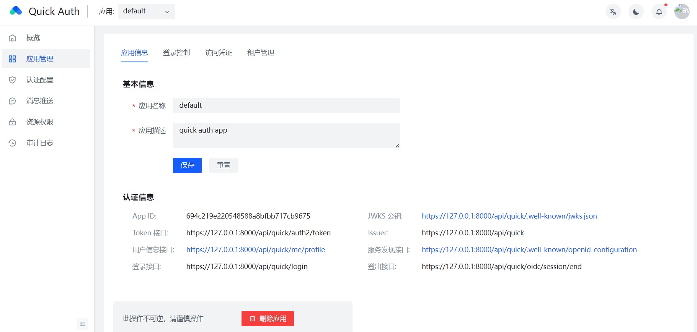

# QuickAuth

QuickAuth是一个基于OpenID Connect协议提供单点登录和授权的服务。



## 主要功能
- 支持多租户和单租户应用，每个应用下可以管理自己的用户及权限分配。
- 支持OAuth2.0认证流程，包括authorization_code、client_credentials、device_code等。
- 内置企业内部账号 provider (钉钉、飞书、企业微信)以及社交账号 provider (QQ、微信、GitHub、Google)。
- 提供前端管理页面，用于配置OAuth客户端信息(如Token信息、第三方登录信息、重定向URL)和权限设置。
- 权限管理支持基于角色(ABAC)和资源组，可通过页面或API接口进行配置。


## 开发命令
- 生成swagger文档
```bash
swag init -o biz/controller/internal/docs
```
